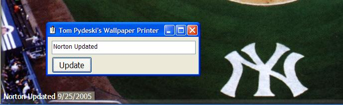



## Print to Wallpaper

### Description

This program will print text onto the Desktop Wallpaper file and make the new picture file the desktop wallpaper.

The name of the wallpaper file is retrieved from the registry and the picture is loaded

into an image control to resize it to fit the screen size. The image is then BitBlt'd

into a picture control, where the desired message is printed to the image in the lower

left hand corner. The modified picture is then saved to a temp file (so as not to modify

the original file). The temp file is then set as the new wallpaper.
 
### More Info
 
The message you want to print on the wallpaper

             |
---                |---
**Submitted On**   |2005-09-25 15:47:36
**By**             |[Tom Pydeski](https://github.com/Planet-Source-Code/PSCIndex/blob/master/ByAuthor/tom-pydeski.md)
**Level**          |Intermediate
**User Rating**    |5.0 (15 globes from 3 users)
**Compatibility**  |VB 6\.0
**Category**       |[Graphics](https://github.com/Planet-Source-Code/PSCIndex/blob/master/ByCategory/graphics__1-46.md)
**World**          |[Visual Basic](https://github.com/Planet-Source-Code/PSCIndex/blob/master/ByWorld/visual-basic.md)
**Archive File**   |[Print\_to\_W1935429252005\.zip](https://github.com/Planet-Source-Code/tom-pydeski-print-to-wallpaper__1-62684/archive/master.zip)

